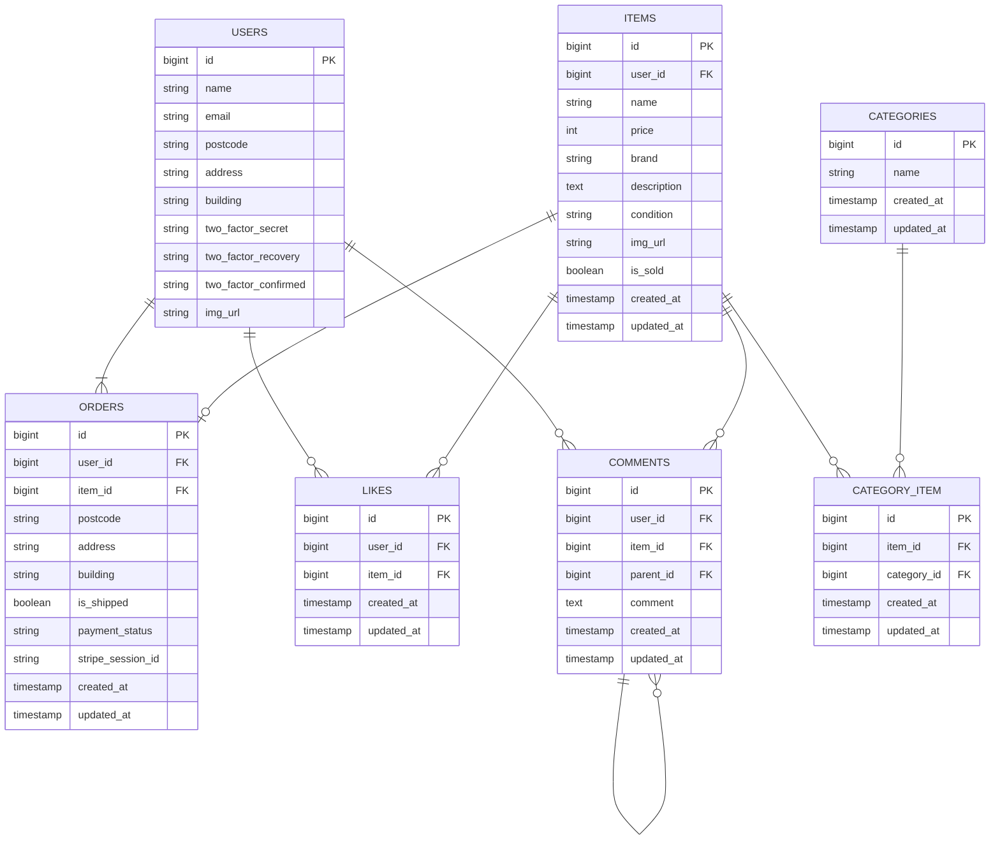

# FLEA-MARKET-App

このリポジトリは、laravelを使用したフリマアプリです。
元々は学習用教材をベースに作成したアプリですが、ポートフォリオ公開にあたり
不具合等を修正、機能の追加、配色・フォントなどのデザイン刷新を行いました。


## 使用技術（実行環境）

- フレームワーク：Laravel 13.x

- 言語：PHP 8.3

- Webサーバー：Nginx 1.21.1

- データベース：MySQL 8.0.26

- 環境構築：Docker / Docker Compose

## ER図



## 開発環境URL

http://localhost:8082/

## 動作環境

- OS: Windows 11 (WSL2 / Ubuntu)
- Docker Desktop

## 環境構築手順

1. **リポジトリをクローン**

    ```bash
    git clone git@github.com:ymwork-dev/flea-market-app.git
    ```

2. **ディレクトリの移動（Laravelソースコード階層へ）**

    ```bash
    cd flea-market-app/src
    ```

3. **.env ファイルの作成**

    ```bash
    cp .env.example .env
    ```

4. **.env ファイルの修正**

    ```bash
    DB_CONNECTION=mysql
    DB_HOST=flea-market-db
    DB_PORT=3306
    DB_DATABASE=flea_market_db
    DB_USERNAME=flea_market_user
    DB_PASSWORD=flea_market_pass
    ```

    **Stripe決済の設定**
    Stripe決済を使用しているため、.env ファイルの一番下にある以下の4行の値を、ご自身のStripeテスト環境のAPIキー（実数）に書き換えてください。

    ```text
    STRIPE_PUBLIC_KEY=your_stripe_public_key_here
    STRIPE_SECRET_KEY=your_stripe_secret_key_here
    STRIPE_KEY=your_stripe_public_key_here
    STRIPE_SECRET=your_stripe_secret_key_here
    ```

    **コンビニ払いの入金確認（Webhook）**
    コンビニ払いは決済手続き完了時点ではまだ入金されておらず、実際の入金確認はStripeからのWebhook通知で行っています。ローカル環境でこれを試すには [Stripe CLI](https://docs.stripe.com/stripe-cli) が必要です。

    ```bash
    # Stripe CLIをインストール後、ログイン
    stripe login

    # Webhookをローカルのコンテナへ転送する(起動したままにしておく)
    stripe listen --forward-to localhost/stripe/webhook
    ```

    起動時に表示される `whsec_...` という値を、.env の `STRIPE_WEBHOOK_SECRET` に設定してください。

    ```text
    STRIPE_WEBHOOK_SECRET=whsec_xxxxxxxxxxxxx
    ```

5. **ディレクトリの移動（Docker設定階層へ戻る）**

    ```bash
    cd ..
    ```

6. **コンテナの起動**

    ```bash
    docker compose up -d --build
    ```

7. **バックエンドPHPライブラリのインストール**

    ```bash
    docker compose exec -u 1000 php composer install
    ```

8. **アプリケーションキーの生成**

    ```bash
    docker compose exec php php artisan key:generate
    ```

9. **画像の表示**

    ```bash
    docker compose exec php sh -c "rm -f public/storage && php artisan storage:link"
    ```

10. **Node.jsのインストール**

    ```bash
    docker compose exec php sh -c "apt-get update && apt-get install -y nodejs npm"
    ```

11. **フロントエンドのビルド**

    ```bash
    docker compose exec php sh -c "npm install && npm run build"
    ```

12. **マイグレーション・シーディングを実行**

    ```bash
    docker compose exec php php artisan migrate:fresh --seed
    ```

13. **権限付与（ストレージの書き込みエラー対策）**

    ```bash
    docker compose exec php chmod -R 777 storage
    ```

14. **アプリケーションへのアクセス**

    - アプリケーションURL: http://localhost:8082/
    - メール確認URL (Mailpit): http://localhost:8025/

## テスト実行

```bash
docker compose exec php php artisan test
```

## 機能一覧

- **ユーザー認証・メール認証機能**（新規会員登録、ログイン・ログアウト、セッション管理、Mailpit連携による認証制限）
- **プロフィール管理機能**（会員プロフィールの編集、商品送付先住所の登録・変更）
- **商品出品機能**（商品画像アップロード、カテゴリー複数選択、商品の状態・商品名・ブランド名・説明・価格設定、出品後の編集・削除）
- **商品一覧・詳細表示機能**（出品された全商品の閲覧、キーワードによる商品検索機能）
- **いいね！機能**（商品詳細画面における商品に対するお気に入り登録および解除）
- **コメント機能**（商品詳細画面での出品者への質問投稿、出品者からの返信）
- **商品購入機能**（Stripe決済連携によるクレジットカード支払いとコンビニ支払いの選択、コンビニ払いはStripe Webhookによる入金確認）
- **発送管理機能**（購入された商品の発送手続き、発送状況に応じた画面表示の切り替え）
- **メール通知機能**（商品が購入された時に出品者へ通知メールを送信）

## APIエンドポイント一覧

なし

## HTTPリクエスト・URI一覧

| HTTPメソッド | URI | 概要 |
|---|---|---|
| GET | / | 商品一覧画面（トップページ） |
| GET | /item/{item_id} | 商品詳細画面 |
| GET | /mypage/profile | プロフィール編集画面（初回登録） |
| POST | /mypage/profile | プロフィール情報の更新処理 |
| GET | /mypage | マイページ（購入・出品履歴閲覧） |
| GET | /sell | 商品出品画面 |
| POST | /sell | 商品出品の保存処理 |
| GET | /sell/{item_id}/edit | 商品編集画面 |
| PUT | /sell/{item_id} | 商品編集の保存処理 |
| DELETE | /sell/{item_id} | 商品削除処理 |
| GET | /purchase/{item_id} | 商品購入画面 |
| POST | /purchase/{item_id} | 商品購入処理（Stripe決済実行） |
| GET | /purchase/success/{item_id} | 商品購入完了画面 |
| POST | /item/{item_id}/ship | 発送済みにする処理（出品者のみ） |
| POST | /comment/{item_id}/comment | 商品へのコメント投稿処理 |
| POST | /comment/{item_id}/comment/{comment_id}/reply | コメントへの返信処理（出品者のみ） |
| POST | /like/{item_id}/like | 商品へのいいね！登録・解除処理 |
| GET | /purchase/address/{item_id} | 送付先住所変更画面 |
| POST | /purchase/address/{item_id} | 送付先住所の更新処理 |
| POST | /purchase/payment/store-session | 決済セッション情報の保存処理 |
| POST | /stripe/webhook | Stripeからの決済状況通知の受信（コンビニ払いの入金確認） |
| GET | /email/verify | メール認証誘導画面（要ログイン） |
| GET | /email/go-to-mailpit | メール確認画面（Mailpit）へのリダイレクト |

